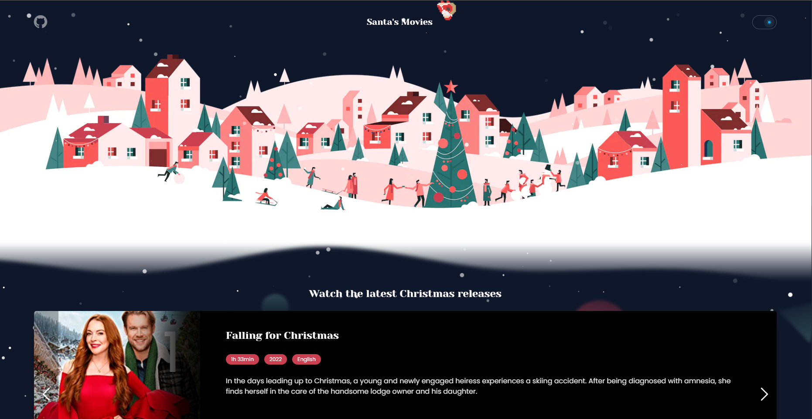

# Santa's Movies
### Aplicação de Filmes Natalinos em Nuxt 3 + Typescript

## Comandos
- Clona o repositório.
``` bash
git clone git@github.com:chrissgon/santasmovies.git
```
- Instala dependências.
``` bash
npm i
```
- Executa aplicação.
``` bash
npm run dev
```

## Anotações
Aplicação hospedada em <a href="http://localhost:3000/">http://localhost:3000/</a>.

## Referências
- [OMDb Api](http://www.omdbapi.com/)
- [Design - Figma](https://www.figma.com/file/YxK10kIuYzz2KvB0BlUYYk/Santas-Movies?t=UtfWb2l7p2VAcdgF-6)

---
Desenvolvido por [Christopher Gonçalves](https://github.com/chrissgon)
